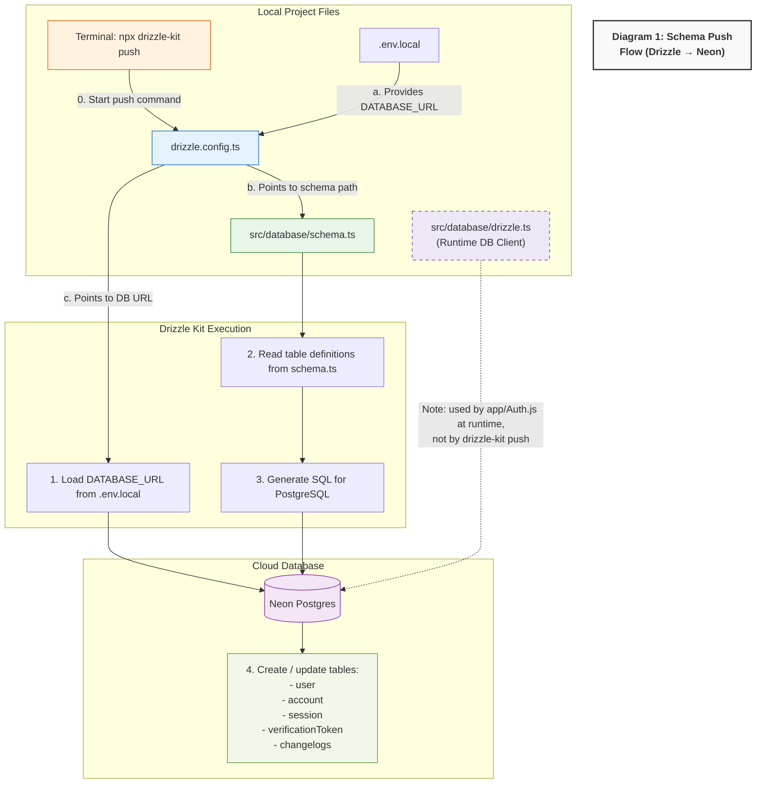
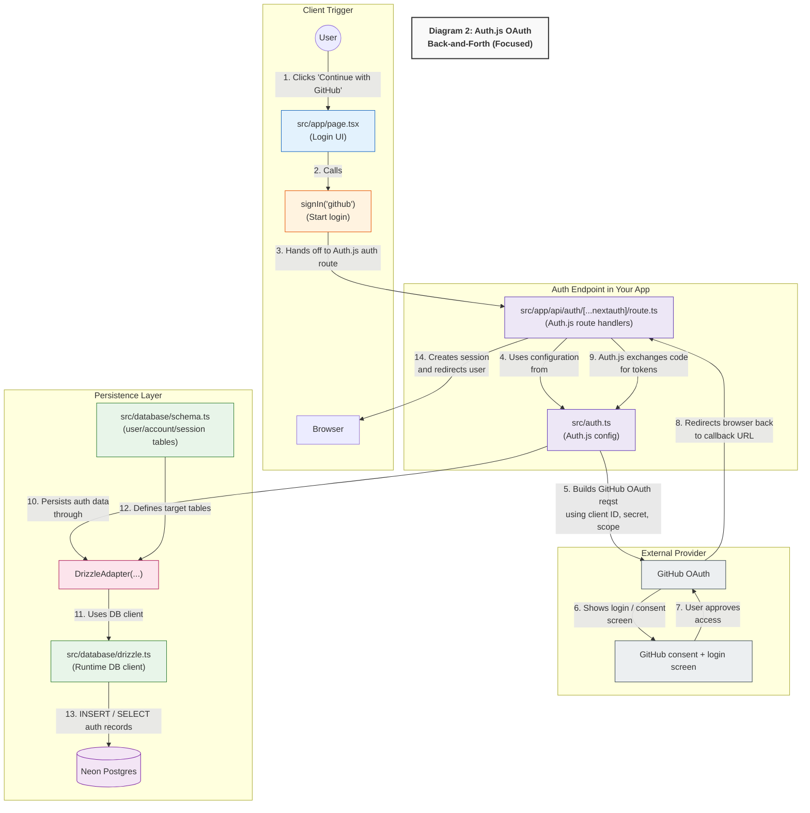
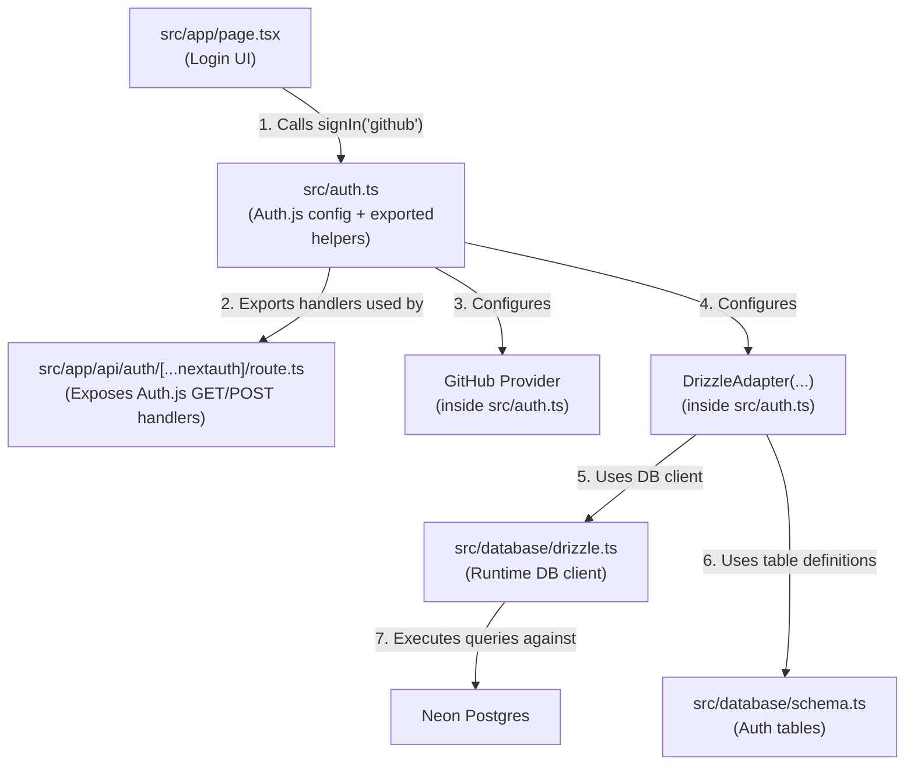
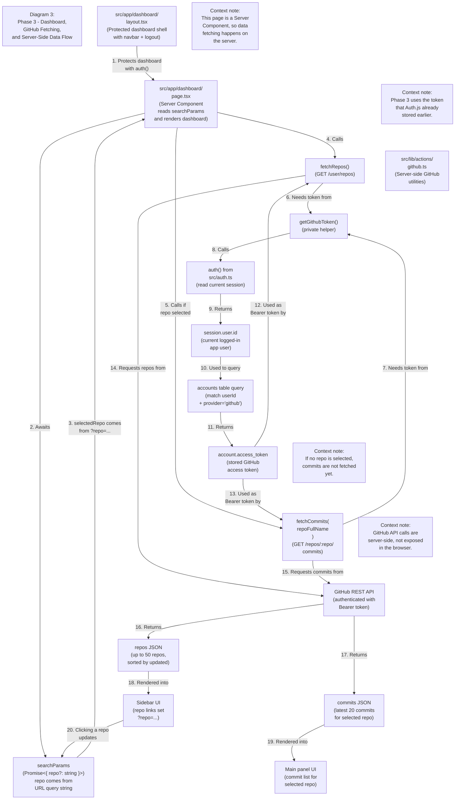
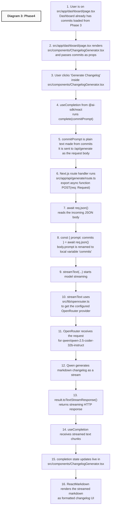
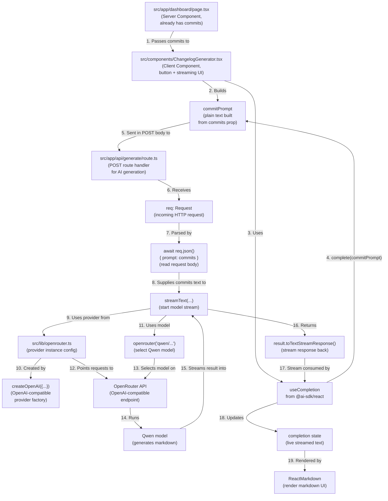
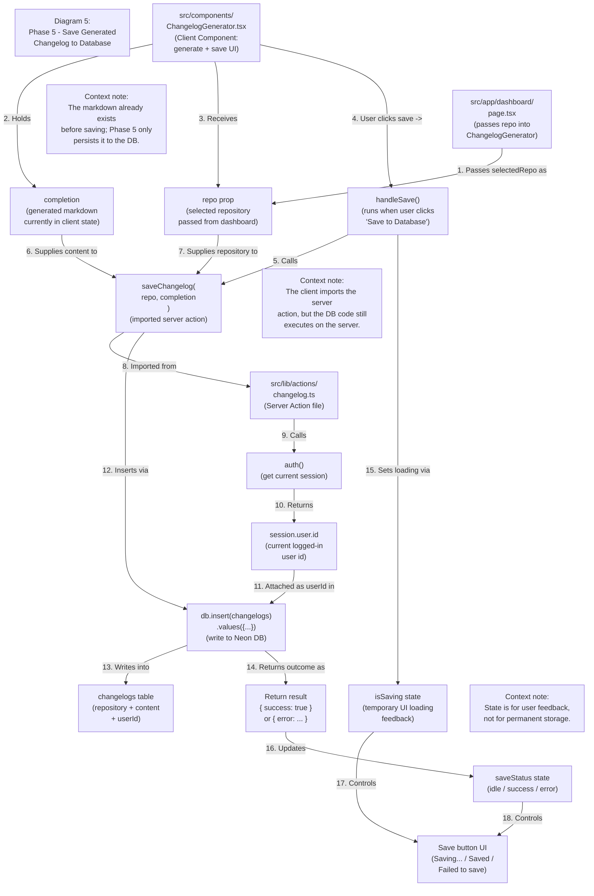

```mermaid
graph TD
    Title_P2_D2["<b>Diagram 1: Schema Push \nFlow (Drizzle → Neon)</b>"]
    style Title_P2_D2 fill:#f9f9f9,stroke:#333,stroke-width:2px,font-size:16px

    subgraph "Local Project Files"
        ENV[".env.local"]
        CONFIG["drizzle.config.ts"]
        SCHEMA["src/database/schema.ts"]
        RUNTIME_DB["src/database/drizzle.ts<br/>(Runtime DB Client)"]
        CMD["Terminal: npx drizzle-kit push"]
    end

    subgraph "Drizzle Kit Execution"
        LOAD_ENV["1. Load DATABASE_URL from .env.local"]
        READ_SCHEMA["2. Read table definitions from schema.ts"]
        GENERATE_SQL["3. Generate SQL for PostgreSQL"]
    end

    subgraph "Cloud Database"
        NEON[("Neon Postgres")]
        TABLES["4. Create / update tables:
- user
- account
- session
- verificationToken
- changelogs"]
    end

    CMD -- "0. Start push command" --> CONFIG
    ENV -- "a. Provides DATABASE_URL" --> CONFIG

    CONFIG -- "b. Points to schema path" --> SCHEMA
    CONFIG -- "c. Points to DB URL" --> LOAD_ENV

    SCHEMA --> READ_SCHEMA
    LOAD_ENV --> NEON
    READ_SCHEMA --> GENERATE_SQL
    GENERATE_SQL --> NEON
    NEON --> TABLES

    RUNTIME_DB -. "Note: used by app/Auth.js at runtime,<br/>not by drizzle-kit push" .-> NEON

    style CMD fill:#fff3e0,stroke:#e65100
    style CONFIG fill:#e3f2fd,stroke:#1565c0
    style SCHEMA fill:#e8f5e9,stroke:#2e7d32
    style RUNTIME_DB fill:#ede7f6,stroke:#5e35b1,stroke-dasharray: 5 5
    style NEON fill:#f3e5f5,stroke:#7b1fa2
    style TABLES fill:#f1f8e9,stroke:#558b2f
```

```mermaid

flowchart TD
    Title_P2_OAuth["<b>Diagram 2: Auth.js OAuth \nBack-and-Forth (Focused)</b>"]
    style Title_P2_OAuth fill:#f9f9f9,stroke:#333,stroke-width:2px,font-size:16px

    subgraph "Client Trigger"
        PAGE["src/app/page.tsx<br/>(Login UI)"]
        ACTION["signIn('github')<br/>(Start login)"]
        USER(("User"))
        BROWSER["Browser"]
    end

    subgraph "Auth Endpoint in Your App"
        ROUTE["src/app/api/auth/[...nextauth]/route.ts<br/>(Auth.js route handlers)"]
        AUTH["src/auth.ts<br/>(Auth.js config)"]
    end

    subgraph "External Provider"
        GITHUB["GitHub OAuth"]
        CONSENT["GitHub consent + login screen"]
    end

    subgraph "Persistence Layer"
        ADAPTER["DrizzleAdapter(...)"]
        DB["src/database/drizzle.ts<br/>(Runtime DB client)"]
        SCHEMA["src/database/schema.ts<br/>(user/account/session tables)"]
        NEON[("Neon Postgres")]
    end

    USER -- "1. Clicks 'Continue with GitHub'" --> PAGE
    PAGE -- "2. Calls" --> ACTION
    ACTION -- "3. Hands off to Auth.js auth route" --> ROUTE
    ROUTE -- "4. Uses configuration \nfrom" --> AUTH
    AUTH -- "5. Builds GitHub OAuth \nreqst<br/>using client ID, secret, scope" --> GITHUB
    GITHUB -- "6. Shows login / consent \nscreen" --> CONSENT
    CONSENT -- "7. User approves \naccess" --> GITHUB
    GITHUB -- "8. Redirects browser back \nto callback URL" --> ROUTE
    ROUTE -- "9. Auth.js exchanges code \nfor tokens" --> AUTH
    AUTH -- "10. Persists auth data \nthrough" --> ADAPTER
    ADAPTER -- "11. Uses DB client" --> DB
    SCHEMA -- "12. Defines target tables" --> ADAPTER
    DB -- "13. INSERT / SELECT auth records" --> NEON
    ROUTE -- "14. Creates session \nand redirects user" --> BROWSER

    style PAGE fill:#e3f2fd,stroke:#1565c0
    style ACTION fill:#fff3e0,stroke:#e65100
    style ROUTE fill:#ede7f6,stroke:#5e35b1
    style AUTH fill:#ede7f6,stroke:#5e35b1
    style GITHUB fill:#eceff1,stroke:#37474f
    style CONSENT fill:#eceff1,stroke:#37474f
    style ADAPTER fill:#fce4ec,stroke:#ad1457
    style DB fill:#e8f5e9,stroke:#2e7d32
    style SCHEMA fill:#e8f5e9,stroke:#2e7d32
    style NEON fill:#f3e5f5,stroke:#7b1fa2
```

```mermaid
flowchart TD
    A["src/app/page.tsx<br/>(Login UI)"]
    B["src/app/api/auth/[...nextauth]/route.ts<br/>(Exposes Auth.js GET/POST handlers)"]
    C["src/auth.ts<br/>(Auth.js config + exported <br/>helpers)"]
    D["GitHub Provider<br/>(inside src/auth.ts)"]
    E["DrizzleAdapter(...)<br/>(inside src/auth.ts)"]
    F["src/database/drizzle.ts<br/>(Runtime DB client)"]
    G["src/database/schema.ts<br/>(Auth tables)"]
    H["Neon Postgres"]

    A -->|"1. Calls signIn('github')"| C
    C -->|"2. Exports handlers used by"| B
    C -->|"3. Configures"| D
    C -->|"4. Configures"| E
    E -->|"5. Uses DB client"| F
    E -->|"6. Uses table definitions"| G
    F -->|"7. Executes queries against"| H

    A ~~~ B
    B ~~~ C
    E ~~~ F
    F ~~~ G
```

```mermaid
flowchart TD
    T["Diagram 3:<br/>Phase 3 - Dashboard,<br/>GitHub Fetching,<br/>and Server-Side Data Flow"]

    A["src/app/dashboard/<br/>layout.tsx<br/>(Protected dashboard shell<br/>with navbar + logout)"]

    B["src/app/dashboard/<br/>page.tsx<br/>(Server Component<br/>reads searchParams<br/>and renders dashboard)"]

    C["searchParams<br/>(Promise<{ repo?: string }>)<br/>repo comes from<br/>URL query string"]

    D["src/lib/actions/<br/>github.ts<br/>(Server-side GitHub<br/>utilities)"]

    E["getGithubToken()<br/>(private helper)"]

    F["auth() from<br/>src/auth.ts<br/>(read current session)"]

    G["session.user.id<br/>(current logged-in<br/>app user)"]

    H["accounts table query<br/>(match userId<br/>+ provider='github')"]

    I["account.access_token<br/>(stored GitHub<br/>access token)"]

    J["fetchRepos()<br/>(GET /user/repos)"]

    K["fetchCommits(<br/>repoFullName<br/>)<br/>(GET /repos/:repo/<br/>commits)"]

    L["GitHub REST API<br/>(authenticated with<br/>Bearer token)"]

    M["repos JSON<br/>(up to 50 repos,<br/>sorted by updated)"]

    N["commits JSON<br/>(latest 20 commits<br/>for selected repo)"]

    O["Sidebar UI<br/>(repo links set<br/>?repo=...)"]

    P["Main panel UI<br/>(commit list for<br/>selected repo)"]

    Q["Context note:<br/>Phase 3 uses the token<br/>that Auth.js already<br/>stored earlier."]

    R["Context note:<br/>This page is a Server<br/>Component, so data<br/>fetching happens on<br/>the server."]

    S["Context note:<br/>GitHub API calls are<br/>server-side, not exposed<br/>in the browser."]

    U["Context note:<br/>If no repo is selected,<br/>commits are not fetched<br/>yet."]

    A -->|"1. Protects dashboard<br/>with auth()"| B
    B -->|"2. Awaits"| C
    C -->|"3. selectedRepo comes<br/>from ?repo=..."| B
    B -->|"4. Calls"| J
    B -->|"5. Calls if<br/>repo selected"| K

    J -->|"6. Needs token from"| E
    K -->|"7. Needs token from"| E
    E -->|"8. Calls"| F
    F -->|"9. Returns"| G
    G -->|"10. Used to query"| H
    H -->|"11. Returns"| I

    I -->|"12. Used as<br/>Bearer token by"| J
    I -->|"13. Used as<br/>Bearer token by"| K
    J -->|"14. Requests repos from"| L
    K -->|"15. Requests commits from"| L
    L -->|"16. Returns"| M
    L -->|"17. Returns"| N

    M -->|"18. Rendered into"| O
    N -->|"19. Rendered into"| P
    O -->|"20. Clicking a repo<br/>updates"| C

    Q ~~~ D
    R ~~~ B
    S ~~~ L
    U ~~~ K

    A ~~~ B
    D ~~~ E
    J ~~~ K
    O ~~~ P
```

```mermaid

flowchart TD
    Title_P2_OAuth["<b>Diagram 3: Phase4 </b>"]
    style Title_P2_OAuth fill:#f9f9f9,stroke:#333,stroke-width:2px,font-size:16px
    A1["1. User is on src/app/dashboard/page.tsx
Dashboard already has commits loaded from Phase 3"]
    A2["2. src/app/dashboard/page.tsx renders
src/components/ChangelogGenerator.tsx
and passes commits as props"]
    A3["3. User clicks 'Generate Changelog'
inside src/components/ChangelogGenerator.tsx"]
    A4["4. useCompletion from @ai-sdk/react
runs complete(commitPrompt)"]
    A5["5. commitPrompt is plain text made from commits
It is sent to /api/generate as the request body"]
    A6["6. Next.js route handler runs
src/app/api/generate/route.ts
export async function POST(req: Request)"]
    A7["7. await req.json()
reads the incoming JSON body"]
    A8["8. const { prompt: commits } = await req.json()
body.prompt is renamed to local variable 'commits'"]
    A9["9. streamText(...) starts model streaming"]
    A10["10. streamText uses
src/lib/openrouter.ts
to get the configured OpenRouter provider"]
    A11["11. OpenRouter receives the request
for qwen/qwen-2.5-coder-32b-instruct"]
    A12["12. Qwen generates markdown changelog as a stream"]
    A13["13. result.toTextStreamResponse()
returns streaming HTTP response"]
    A14["14. useCompletion receives streamed text chunks"]
    A15["15. completion state updates live in
src/components/ChangelogGenerator.tsx"]
    A16["16. ReactMarkdown renders the streamed markdown
as formatted changelog UI"]

    A1 --> A2
    A2 --> A3
    A3 --> A4
    A4 --> A5
    A5 --> A6
    A6 --> A7
    A7 --> A8
    A8 --> A9
    A9 --> A10
    A10 --> A11
    A11 --> A12
    A12 --> A13
    A13 --> A14
    A14 --> A15
    A15 --> A16
```

```mermaid
flowchart TD
    A["src/app/dashboard/page.tsx<br/>(Server Component,<br/>already has commits)"]
    B["src/components/ChangelogGenerator.tsx<br/>(Client Component,<br/>button + streaming UI)"]
    C["commitPrompt<br/>(plain text built<br/>from commits prop)"]
    D["src/app/api/generate/route.ts<br/>(POST route handler<br/>for AI generation)"]
    E["req: Request<br/>(incoming HTTP request)"]
    F["await req.json()<br/>{ prompt: commits }<br/>(read request body)"]
    G["streamText(...)<br/>(start model stream)"]
    H["src/lib/openrouter.ts<br/>(provider instance config)"]
    I["createOpenAI({...})<br/>(OpenAI-compatible<br/>provider factory)"]
    J["openrouter('qwen/...')<br/>(select Qwen model)"]
    K["OpenRouter API<br/>(OpenAI-compatible endpoint)"]
    L["Qwen model<br/>(generates markdown)"]
    M["result.toTextStreamResponse()<br/>(stream response back)"]
    N["useCompletion<br/>from @ai-sdk/react"]
    O["completion state<br/>(live streamed text)"]
    P["ReactMarkdown<br/>(render markdown UI)"]

    A -->|"1. Passes commits to"| B
    B -->|"2. Builds"| C
    B -->|"3. Uses"| N
    N -->|"4. complete(commitPrompt)"| C
    C -->|"5. Sent in POST body to"| D
    D -->|"6. Receives"| E
    E -->|"7. Parsed by"| F
    F -->|"8. Supplies commits text to"| G
    G -->|"9. Uses provider from"| H
    H -->|"10. Created by"| I
    G -->|"11. Uses model"| J
    H -->|"12. Points requests to"| K
    J -->|"13. Selects model on"| K
    K -->|"14. Runs"| L
    L -->|"15. Streams result into"| G
    G -->|"16. Returns"| M
    M -->|"17. Stream consumed by"| N
    N -->|"18. Updates"| O
    O -->|"19. Rendered by"| P

    A ~~~ B
    B ~~~ D
    D ~~~ H
    N ~~~ O
```

```mermaid
flowchart TD
    T["Diagram 5:<br/>Phase 5 - Save Generated<br/>Changelog to Database"]

    A["src/components/<br/>ChangelogGenerator.tsx<br/>(Client Component:<br/>generate + save UI)"]

    B["completion<br/>(generated markdown<br/>currently in client state)"]

    C["repo prop<br/>(selected repository<br/>passed from dashboard)"]

    D["handleSave()<br/>(runs when user clicks<br/>'Save to Database')"]

    E["saveChangelog(<br/>repo, completion<br/>)<br/>(imported server action)"]

    F["src/lib/actions/<br/>changelog.ts<br/>(Server Action file)"]

    G["auth()<br/>(get current session)"]

    H["session.user.id<br/>(current logged-in<br/>user id)"]

    I["db.insert(changelogs)<br/>.values({...})<br/>(write to Neon DB)"]

    J["changelogs table<br/>(repository + content<br/>+ userId)"]

    K["Return result<br/>{ success: true }<br/>or { error: ... }"]

    L["isSaving state<br/>(temporary UI loading<br/>feedback)"]

    M["saveStatus state<br/>(idle / success / error)"]

    N["Save button UI<br/>(Saving... / Saved /<br/>Failed to save)"]

    O["src/app/dashboard/<br/>page.tsx<br/>(passes repo into<br/>ChangelogGenerator)"]

    P["Context note:<br/>The markdown already exists<br/>before saving; Phase 5 only<br/>persists it to the DB."]

    Q["Context note:<br/>The client imports the server<br/>action, but the DB code still<br/>executes on the server."]

    R["Context note:<br/>State is for user feedback,<br/>not for permanent storage."]

    O -->|"1. Passes selectedRepo as"| C
    A -->|"2. Holds"| B
    A -->|"3. Receives"| C
    A -->|"4. User clicks save ->"| D
    D -->|"5. Calls"| E
    B -->|"6. Supplies content to"| E
    C -->|"7. Supplies repository to"| E

    E -->|"8. Imported from"| F
    F -->|"9. Calls"| G
    G -->|"10. Returns"| H
    H -->|"11. Attached as userId in"| I
    E -->|"12. Inserts via"| I
    I -->|"13. Writes into"| J
    I -->|"14. Returns outcome as"| K

    D -->|"15. Sets loading via"| L
    K -->|"16. Updates"| M
    L -->|"17. Controls"| N
    M -->|"18. Controls"| N

    P ~~~ B
    Q ~~~ F
    R ~~~ M

    A ~~~ O
    E ~~~ F
    L ~~~ M
```