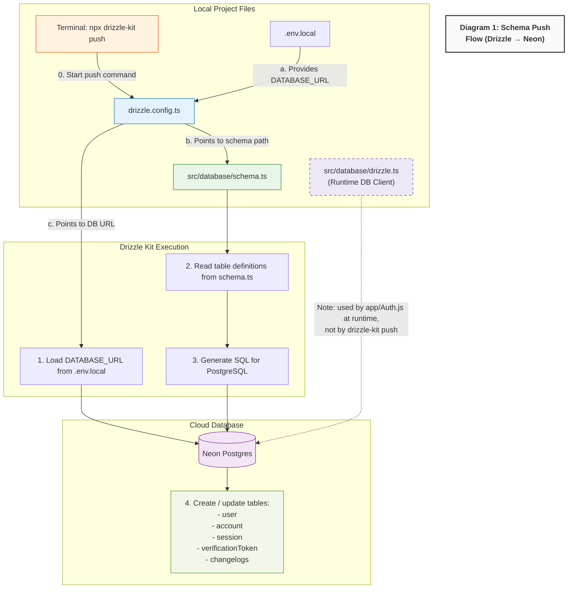
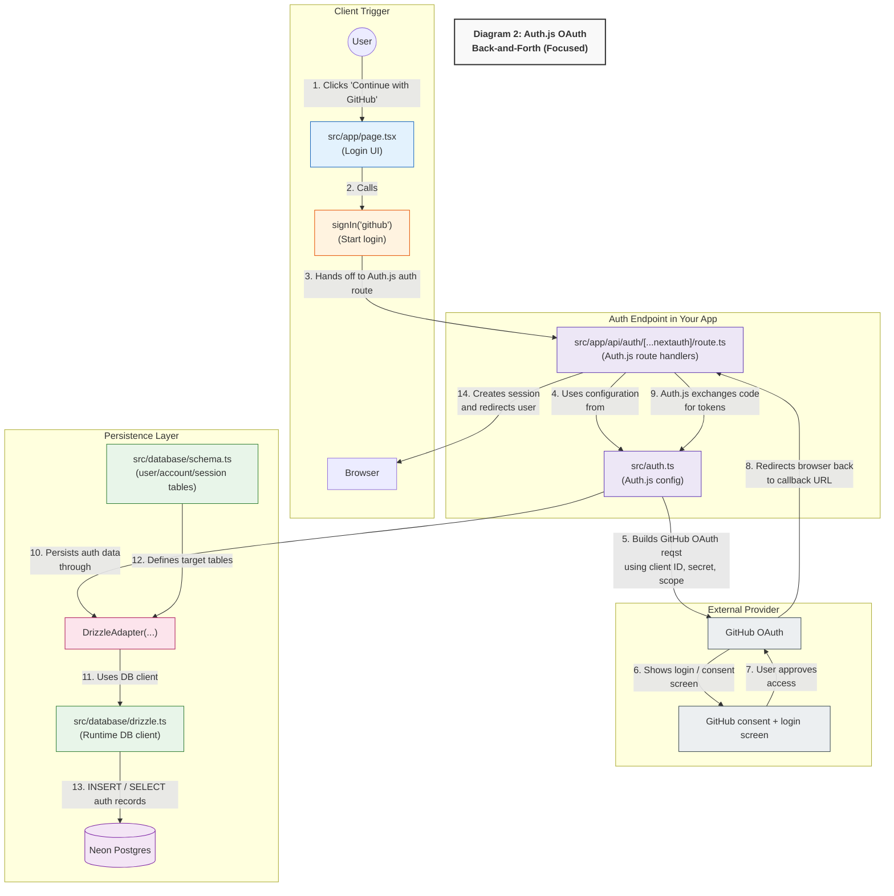
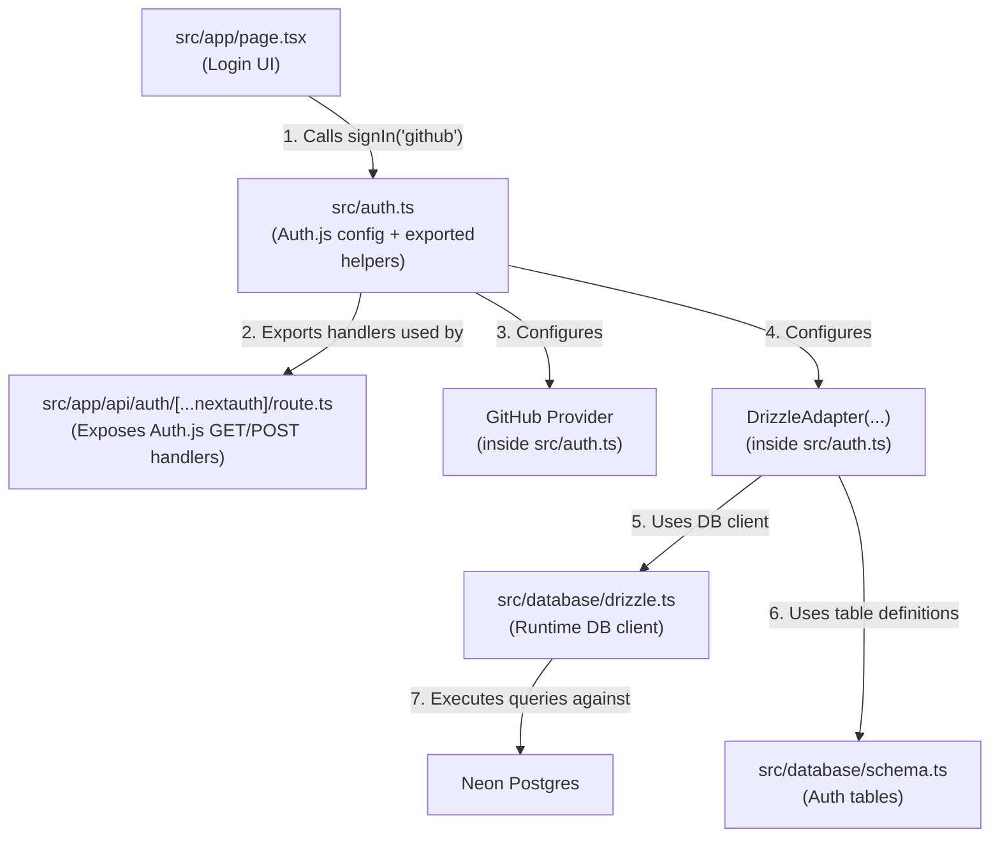

```mermaid
graph TD
    Title_P2_D2["<b>Diagram 1: Schema Push \nFlow (Drizzle → Neon)</b>"]
    style Title_P2_D2 fill:#f9f9f9,stroke:#333,stroke-width:2px,font-size:16px

    subgraph "Local Project Files"
        ENV[".env.local"]
        CONFIG["drizzle.config.ts"]
        SCHEMA["src/database/schema.ts"]
        RUNTIME_DB["src/database/drizzle.ts<br/>(Runtime DB Client)"]
        CMD["Terminal: npx drizzle-kit push"]
    end

    subgraph "Drizzle Kit Execution"
        LOAD_ENV["1. Load DATABASE_URL from .env.local"]
        READ_SCHEMA["2. Read table definitions from schema.ts"]
        GENERATE_SQL["3. Generate SQL for PostgreSQL"]
    end

    subgraph "Cloud Database"
        NEON[("Neon Postgres")]
        TABLES["4. Create / update tables:
- user
- account
- session
- verificationToken
- changelogs"]
    end

    CMD -- "0. Start push command" --> CONFIG
    ENV -- "a. Provides DATABASE_URL" --> CONFIG

    CONFIG -- "b. Points to schema path" --> SCHEMA
    CONFIG -- "c. Points to DB URL" --> LOAD_ENV

    SCHEMA --> READ_SCHEMA
    LOAD_ENV --> NEON
    READ_SCHEMA --> GENERATE_SQL
    GENERATE_SQL --> NEON
    NEON --> TABLES

    RUNTIME_DB -. "Note: used by app/Auth.js at runtime,<br/>not by drizzle-kit push" .-> NEON

    style CMD fill:#fff3e0,stroke:#e65100
    style CONFIG fill:#e3f2fd,stroke:#1565c0
    style SCHEMA fill:#e8f5e9,stroke:#2e7d32
    style RUNTIME_DB fill:#ede7f6,stroke:#5e35b1,stroke-dasharray: 5 5
    style NEON fill:#f3e5f5,stroke:#7b1fa2
    style TABLES fill:#f1f8e9,stroke:#558b2f
```

```mermaid

flowchart TD
    Title_P2_OAuth["<b>Diagram 2: Auth.js OAuth \nBack-and-Forth (Focused)</b>"]
    style Title_P2_OAuth fill:#f9f9f9,stroke:#333,stroke-width:2px,font-size:16px

    subgraph "Client Trigger"
        PAGE["src/app/page.tsx<br/>(Login UI)"]
        ACTION["signIn('github')<br/>(Start login)"]
        USER(("User"))
        BROWSER["Browser"]
    end

    subgraph "Auth Endpoint in Your App"
        ROUTE["src/app/api/auth/[...nextauth]/route.ts<br/>(Auth.js route handlers)"]
        AUTH["src/auth.ts<br/>(Auth.js config)"]
    end

    subgraph "External Provider"
        GITHUB["GitHub OAuth"]
        CONSENT["GitHub consent + login screen"]
    end

    subgraph "Persistence Layer"
        ADAPTER["DrizzleAdapter(...)"]
        DB["src/database/drizzle.ts<br/>(Runtime DB client)"]
        SCHEMA["src/database/schema.ts<br/>(user/account/session tables)"]
        NEON[("Neon Postgres")]
    end

    USER -- "1. Clicks 'Continue with GitHub'" --> PAGE
    PAGE -- "2. Calls" --> ACTION
    ACTION -- "3. Hands off to Auth.js auth route" --> ROUTE
    ROUTE -- "4. Uses configuration \nfrom" --> AUTH
    AUTH -- "5. Builds GitHub OAuth \nreqst<br/>using client ID, secret, scope" --> GITHUB
    GITHUB -- "6. Shows login / consent \nscreen" --> CONSENT
    CONSENT -- "7. User approves \naccess" --> GITHUB
    GITHUB -- "8. Redirects browser back \nto callback URL" --> ROUTE
    ROUTE -- "9. Auth.js exchanges code \nfor tokens" --> AUTH
    AUTH -- "10. Persists auth data \nthrough" --> ADAPTER
    ADAPTER -- "11. Uses DB client" --> DB
    SCHEMA -- "12. Defines target tables" --> ADAPTER
    DB -- "13. INSERT / SELECT auth records" --> NEON
    ROUTE -- "14. Creates session \nand redirects user" --> BROWSER

    style PAGE fill:#e3f2fd,stroke:#1565c0
    style ACTION fill:#fff3e0,stroke:#e65100
    style ROUTE fill:#ede7f6,stroke:#5e35b1
    style AUTH fill:#ede7f6,stroke:#5e35b1
    style GITHUB fill:#eceff1,stroke:#37474f
    style CONSENT fill:#eceff1,stroke:#37474f
    style ADAPTER fill:#fce4ec,stroke:#ad1457
    style DB fill:#e8f5e9,stroke:#2e7d32
    style SCHEMA fill:#e8f5e9,stroke:#2e7d32
    style NEON fill:#f3e5f5,stroke:#7b1fa2
```

```mermaid
flowchart TD
    A["src/app/page.tsx<br/>(Login UI)"]
    B["src/app/api/auth/[...nextauth]/route.ts<br/>(Exposes Auth.js GET/POST handlers)"]
    C["src/auth.ts<br/>(Auth.js config + exported <br/>helpers)"]
    D["GitHub Provider<br/>(inside src/auth.ts)"]
    E["DrizzleAdapter(...)<br/>(inside src/auth.ts)"]
    F["src/database/drizzle.ts<br/>(Runtime DB client)"]
    G["src/database/schema.ts<br/>(Auth tables)"]
    H["Neon Postgres"]

    A -->|"1. Calls signIn('github')"| C
    C -->|"2. Exports handlers used by"| B
    C -->|"3. Configures"| D
    C -->|"4. Configures"| E
    E -->|"5. Uses DB client"| F
    E -->|"6. Uses table definitions"| G
    F -->|"7. Executes queries against"| H

    A ~~~ B
    B ~~~ C
    E ~~~ F
    F ~~~ G
```