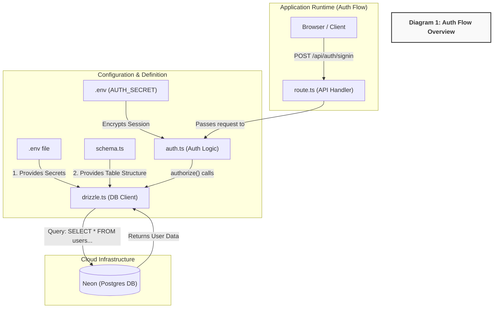
```mermaid
graph TD
    %% Diagram 1: Auth Flow Overview
    Title_D1["<b>Diagram 1: Auth Flow Overview</b>"]
    style Title_D1 fill:#f9f9f9,stroke:#333,stroke-width:2px,font-size:16px

    subgraph "Configuration & Definition"
        A[".env file"] -- "1. Provides Secrets" --> C("drizzle.ts")
        B["schema.ts"] -- "2. Provides Table Structure" --> C
        SECRET[".env (AUTH_SECRET)"] -- "Encrypts Session" --> AUTH["auth.ts"]
    end

    subgraph "Application Runtime (Auth Flow)"
        BROWSER["Browser / Client"] -- "POST /api/auth/signin" --> ROUTE["route.ts (API Handler)"]

        ROUTE -- "Passes request to" --> AUTH["auth.ts (Auth Logic)"]

        AUTH -- "authorize() calls" --> C["drizzle.ts (DB Client)"]
    end

    subgraph "Cloud Infrastructure"
        C -- "Query: SELECT * FROM users..." --> NEON[("Neon (Postgres DB)")]
        NEON -- "Returns User Data" --> C
    end
```

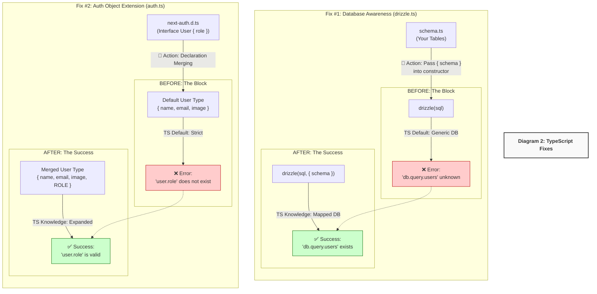
```mermaid
graph TD
    %% Diagram 2: TypeScript Fixes
    Title_D2["<b>Diagram 2: TypeScript Fixes</b>"]
    style Title_D2 fill:#f9f9f9,stroke:#333,stroke-width:2px,font-size:16px

    %% Fix #1: Database Awareness
    subgraph "Fix #1: Database Awareness (drizzle.ts)"
        direction TB

        subgraph "BEFORE: The Block"
            DB_DEFAULT["drizzle(sql)"] -- "TS Default: Generic DB" --> ERR1["❌ Error:<br/>'db.query.users' unknown"]
            style ERR1 fill:#ffcccc,stroke:#b30000
        end

        SCHEMA["schema.ts<br/>(Your Tables)"] -- "🚀 Action: Pass { schema }<br/>into constructor" --> DB_DEFAULT

        subgraph "AFTER: The Success"
            DB_FIXED["drizzle(sql, { schema })"] -- "TS Knowledge: Mapped DB" --> OK1["✅ Success:<br/>'db.query.users' exists"]
            style OK1 fill:#ccffcc,stroke:#006600
        end

        ERR1 -.-> OK1
    end

    %% Fix #2: Auth Object Extension
    subgraph "Fix #2: Auth Object Extension (auth.ts)"
        direction TB

        subgraph "BEFORE: The Block"
            USER_DEF["Default User Type<br/>{ name, email, image }"] -- "TS Default: Strict" --> ERR2["❌ Error:<br/>'user.role' does not exist"]
            style ERR2 fill:#ffcccc,stroke:#b30000
        end

        TYPE_FILE["next-auth.d.ts<br/>(Interface User { role })"] -- "🚀 Action: Declaration Merging" --> USER_DEF

        subgraph "AFTER: The Success"
            USER_MERGED["Merged User Type<br/>{ name, email, image, ROLE }"] -- "TS Knowledge: Expanded" --> OK2["✅ Success:<br/>'user.role' is valid"]
            style OK2 fill:#ccffcc,stroke:#006600
        end

        ERR2 -.-> OK2
    end
```

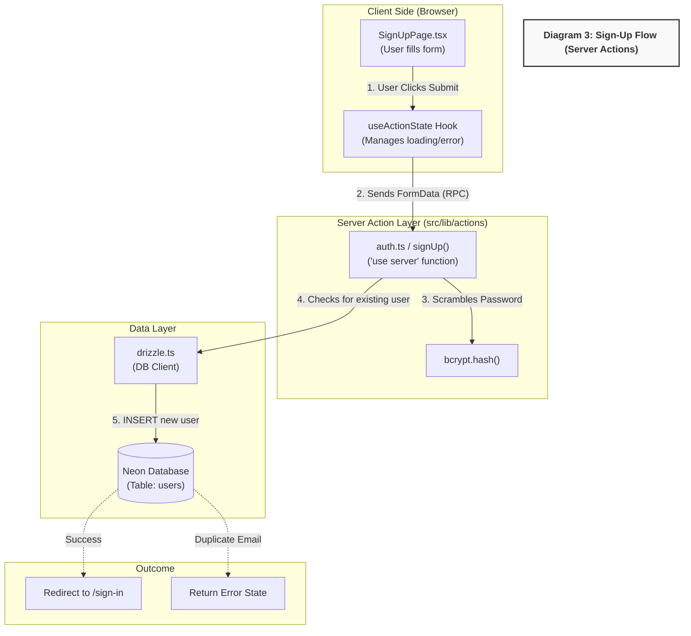
```mermaid
graph TD
    %% Diagram 3: Sign-Up Flow
    Title_D3["<b>Diagram 3: Sign-Up Flow (Server Actions)</b>"]
    style Title_D3 fill:#f9f9f9,stroke:#333,stroke-width:2px,font-size:16px

    subgraph "Client Side (Browser)"
        UI["SignUpPage.tsx<br/>(User fills form)"]
        HOOK["useActionState Hook<br/>(Manages loading/error)"]

        UI -- "1. User Clicks Submit" --> HOOK
    end

    subgraph "Server Action Layer (src/lib/actions)"
        ACTION["auth.ts / signUp()<br/>('use server' function)"]
        BCRYPT["bcrypt.hash()"]

        HOOK -- "2. Sends FormData (RPC)" --> ACTION
        ACTION -- "3. Scrambles Password" --> BCRYPT
    end

    subgraph "Data Layer"
        DRIZZLE["drizzle.ts<br/>(DB Client)"]
        NEON[("Neon Database<br/>(Table: users)")]

        ACTION -- "4. Checks for existing user" --> DRIZZLE
        DRIZZLE -- "5. INSERT new user" --> NEON
    end

    subgraph "Outcome"
        REDIRECT["Redirect to /sign-in"]
        ERROR["Return Error State"]

        NEON -.->|"Success"| REDIRECT
        NEON -.->|"Duplicate Email"| ERROR
    end
```

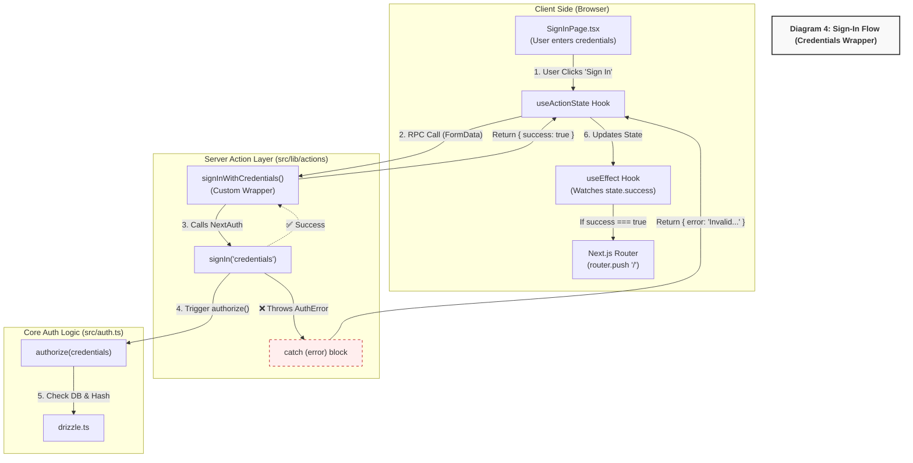
```mermaid
graph TD
    %% Diagram 4: Sign-In Flow
    Title_D4["<b>Diagram 4: Sign-In Flow (Credentials Wrapper)</b>"]
    style Title_D4 fill:#f9f9f9,stroke:#333,stroke-width:2px,font-size:16px

    subgraph "Client Side (Browser)"
        UI["SignInPage.tsx<br/>(User enters credentials)"]
        HOOK["useActionState Hook"]
        EFFECT["useEffect Hook<br/>(Watches state.success)"]
        ROUTER["Next.js Router<br/>(router.push '/')"]

        UI -- "1. User Clicks 'Sign In'" --> HOOK
    end

    subgraph "Server Action Layer (src/lib/actions)"
        WRAPPER["signInWithCredentials()<br/>(Custom Wrapper)"]

        HOOK -- "2. RPC Call (FormData)" --> WRAPPER
        WRAPPER -- "3. Calls NextAuth" --> NEXTAUTH_FN["signIn('credentials')"]

        %% Error Handling Path
        NEXTAUTH_FN -- "❌ Throws AuthError" --> CATCH["catch (error) block"]
        CATCH -- "Return { error: 'Invalid...' }" --> HOOK

        %% Success Path
        NEXTAUTH_FN -.->|"✅ Success"| WRAPPER
        WRAPPER -- "Return { success: true }" --> HOOK
    end

    subgraph "Core Auth Logic (src/auth.ts)"
        NEXTAUTH_FN -- "4. Trigger authorize()" --> AUTHORIZE["authorize(credentials)"]
        AUTHORIZE -- "5. Check DB & Hash" --> DB["drizzle.ts"]
    end

    %% Client Response Handling
    HOOK -- "6. Updates State" --> EFFECT
    EFFECT -- "If success === true" --> ROUTER

    style CATCH fill:#ffeeee,stroke:#b30000,stroke-dasharray: 5 5
```

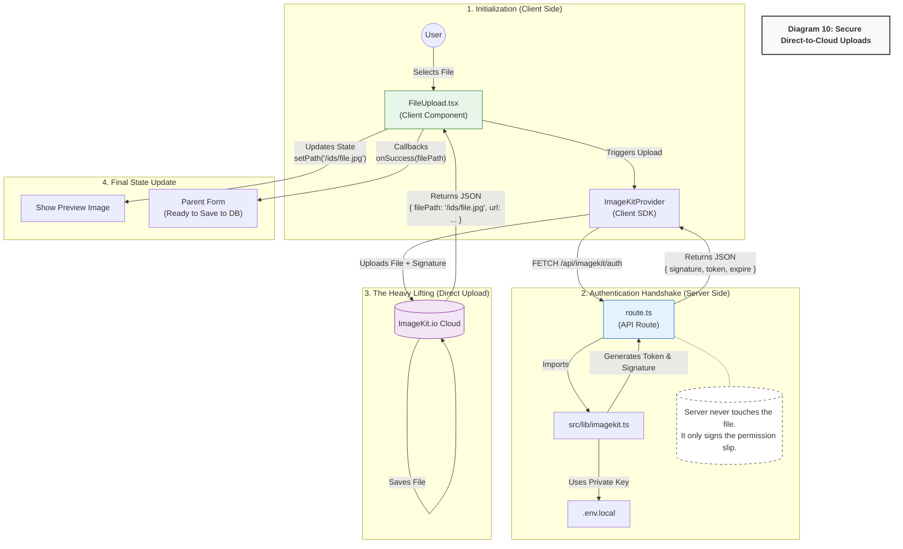
```mermaid
graph TD
    %% Diagram a: ImageKit
    Title_D10["<b>Diagram 10: Secure Direct-to-Cloud Uploads</b>"]
    style Title_D10 fill:#f9f9f9,stroke:#333,stroke-width:2px,font-size:16px

    subgraph "1. Initialization (Client Side)"
        USER(("User"))
        COMPONENT["FileUpload.tsx<br/>(Client Component)"]
        SDK["ImageKitProvider<br/>(Client SDK)"]

        USER -- "Selects File" --> COMPONENT
        COMPONENT -- "Triggers Upload" --> SDK
    end

    subgraph "2. Authentication Handshake (Server Side)"
        SDK -- "FETCH /api/imagekit/auth" --> ROUTE["route.ts<br/>(API Route)"]

        ROUTE -- "Imports" --> UTILS["src/lib/imagekit.ts"]
        UTILS -- "Uses Private Key" --> ENV[".env.local"]

        UTILS -- "Generates Token & Signature" --> ROUTE
        ROUTE -- "Returns JSON<br/>{ signature, token, expire }" --> SDK

        note1[("Server never touches the file.<br/>It only signs the permission slip.")]
        style note1 fill:#fff,stroke:#333,stroke-dasharray: 5 5
        ROUTE -.- note1
    end

    subgraph "3. The Heavy Lifting (Direct Upload)"
        SDK -- "Uploads File + Signature" --> CLOUD[("ImageKit.io Cloud")]

        CLOUD -- "Verifies Signature" --> CLOUD
        CLOUD -- "Saves File" --> CLOUD
        CLOUD -- "Returns JSON<br/>{ filePath: '/ids/file.jpg', url: ... }" --> COMPONENT
    end

    subgraph "4. Final State Update"
        COMPONENT -- "Updates State<br/>setPath('/ids/file.jpg')" --> UI["Show Preview Image"]
        COMPONENT -- "Callbacks<br/>onSuccess(filePath)" --> FORM["Parent Form<br/>(Ready to Save to DB)"]
    end

    %% Styling
    style ROUTE fill:#e3f2fd,stroke:#1565c0
    style CLOUD fill:#f3e5f5,stroke:#7b1fa2
    style COMPONENT fill:#e8f5e9,stroke:#2e7d32
```

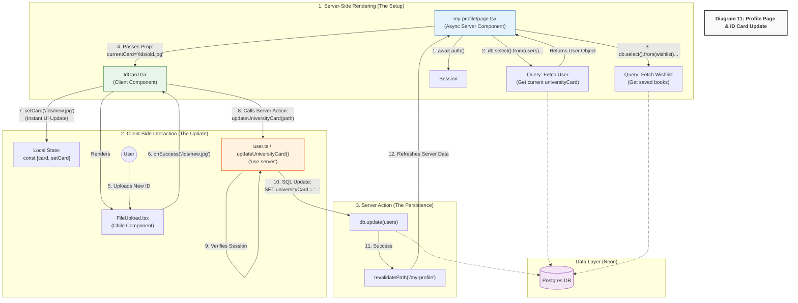
```mermaid
graph TD
    %% Diagram b: Profile & ID Update
    Title_D11["<b>Diagram 11: Profile Page & ID Card Update</b>"]
    style Title_D11 fill:#f9f9f9,stroke:#333,stroke-width:2px,font-size:16px

    subgraph "1. Server-Side Rendering (The Setup)"
        PAGE["my-profile/page.tsx<br/>(Async Server Component)"]
        DB_QUERY_USER["Query: Fetch User<br/>(Get current universityCard)"]
        DB_QUERY_WISH["Query: Fetch Wishlist<br/>(Get saved books)"]

        PAGE -- "1. await auth()" --> SESSION["Session"]
        PAGE -- "2. db.select().from(users)..." --> DB_QUERY_USER
        PAGE -- "3. db.select().from(wishlist)..." --> DB_QUERY_WISH

        DB_QUERY_USER -- "Returns User Object" --> PAGE

        PAGE -- "4. Passes Prop:<br/>currentCard='/ids/old.jpg'" --> CLIENT_COMP
    end

    subgraph "2. Client-Side Interaction (The Update)"
        CLIENT_COMP["IdCard.tsx<br/>(Client Component)"]
        UPLOAD_COMP["FileUpload.tsx<br/>(Child Component)"]
        STATE["Local State:<br/>const [card, setCard]"]

        CLIENT_COMP -- "Renders" --> UPLOAD_COMP

        USER(("User")) -- "5. Uploads New ID" --> UPLOAD_COMP
        UPLOAD_COMP -- "6. onSuccess('/ids/new.jpg')" --> CLIENT_COMP

        CLIENT_COMP -- "7. setCard('/ids/new.jpg')<br/>(Instant UI Update)" --> STATE
        CLIENT_COMP -- "8. Calls Server Action:<br/>updateUniversityCard(path)" --> SERVER_ACTION
    end

    subgraph "3. Server Action (The Persistence)"
        SERVER_ACTION["user.ts / updateUniversityCard()<br/>('use server')"]
        DB_UPDATE["db.update(users)"]
        CACHE["revalidatePath('/my-profile')"]

        SERVER_ACTION -- "9. Verifies Session" --> SERVER_ACTION
        SERVER_ACTION -- "10. SQL Update:<br/>SET universityCard = '...'" --> DB_UPDATE

        DB_UPDATE -- "11. Success" --> CACHE
        CACHE -- "12. Refreshes Server Data" --> PAGE
    end

    subgraph "Data Layer (Neon)"
        NEON[("Postgres DB")]

        DB_QUERY_USER -.-> NEON
        DB_QUERY_WISH -.-> NEON
        DB_UPDATE -.-> NEON
    end

    %% Styling
    style PAGE fill:#e3f2fd,stroke:#1565c0
    style CLIENT_COMP fill:#e8f5e9,stroke:#2e7d32
    style SERVER_ACTION fill:#fff3e0,stroke:#e65100
    style NEON fill:#f3e5f5,stroke:#7b1fa2
```

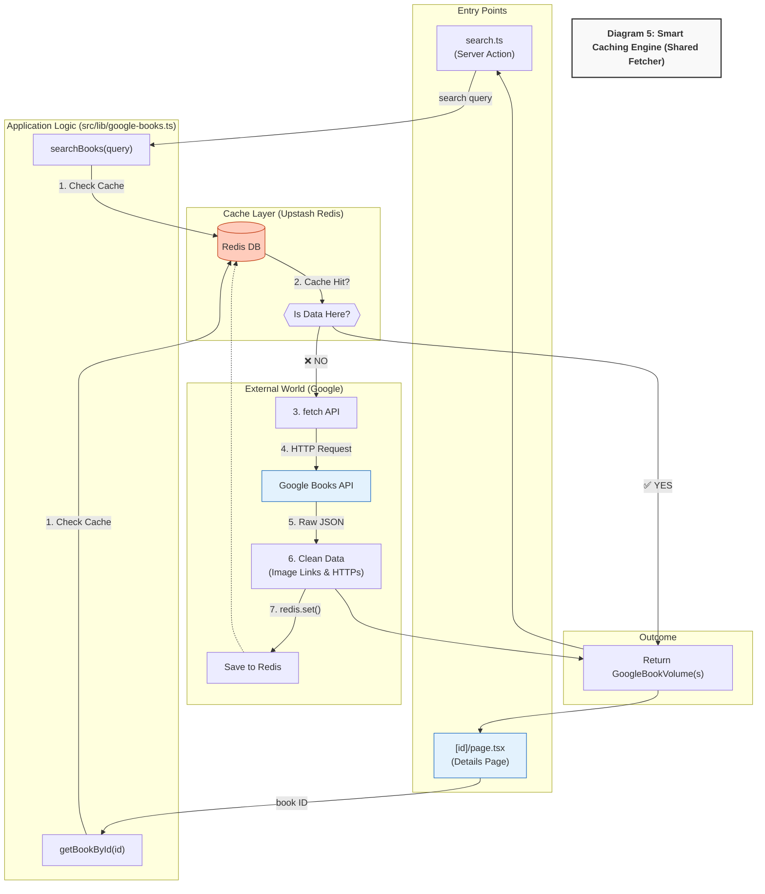
```mermaid
graph TD
    %% Diagram Title
    Title_D5["<b>Diagram 5: Smart Caching Engine (Shared Fetcher)</b>"]
    style Title_D5 fill:#f9f9f9,stroke:#333,stroke-width:2px,font-size:16px

    subgraph "Entry Points"
        ACTION["search.ts<br/>(Server Action)"]
        DETAILS["[id]/page.tsx<br/>(Details Page)"]
    end

    subgraph "Application Logic (src/lib/google-books.ts)"
        SEARCH["searchBooks(query)"]
        GET_BY_ID["getBookById(id)"]

        ACTION -- "search query" --> SEARCH
        DETAILS -- "book ID" --> GET_BY_ID
    end

    subgraph "Cache Layer (Upstash Redis)"
        REDIS_DB[("Redis DB")]
        SEARCH -- "1. Check Cache" --> REDIS_DB
        GET_BY_ID -- "1. Check Cache" --> REDIS_DB

        REDIS_DB -- "2. Cache Hit?" --> RESULT{{"Is Data Here?"}}
    end

    subgraph "External World (Google)"
        API["Google Books API"]

        RESULT -- "❌ NO" --> FETCH["3. fetch API"]
        FETCH -- "4. HTTP Request" --> API
        API -- "5. Raw JSON" --> CLEAN["6. Clean Data<br/>(Image Links & HTTPs)"]
        CLEAN -- "7. redis.set()" --> REDIS_SET["Save to Redis"]
        REDIS_SET -.-> REDIS_DB
    end

    subgraph "Outcome"
        RETURN["Return GoogleBookVolume(s)"]
        RESULT -- "✅ YES" --> RETURN
        CLEAN --> RETURN
        RETURN --> ACTION
        RETURN --> DETAILS
    end

    style REDIS_DB fill:#ffccbc,stroke:#bf360c
    style API fill:#e3f2fd,stroke:#1565c0
    style DETAILS fill:#e3f2fd,stroke:#1565c0
```

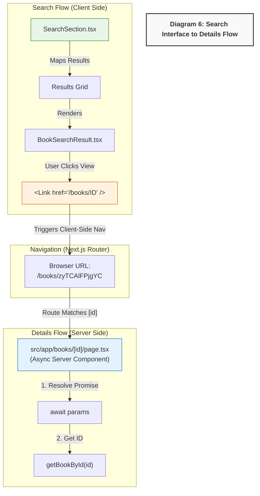
```mermaid
graph TD
    %% Diagram Title
    Title_D6["<b>Diagram 6: Search Interface to Details Flow</b>"]
    style Title_D6 fill:#f9f9f9,stroke:#333,stroke-width:2px,font-size:16px

    subgraph "Search Flow (Client Side)"
        SECTION["SearchSection.tsx"]
        GRID["Results Grid"]
        CARD["BookSearchResult.tsx"]
        LINK["&lt;Link href='/books/ID' /&gt;"]

        SECTION -- "Maps Results" --> GRID
        GRID -- "Renders" --> CARD
        CARD -- "User Clicks View" --> LINK
    end

    subgraph "Navigation (Next.js Router)"
        URL["Browser URL:<br/>/books/zyTCAlFPjgYC"]
        LINK -- "Triggers Client-Side Nav" --> URL
    end

    subgraph "Details Flow (Server Side)"
        PAGE["src/app/books/[id]/page.tsx<br/>(Async Server Component)"]
        PARAMS["await params"]
        FETCH["getBookById(id)"]

        URL -- "Route Matches [id]" --> PAGE
        PAGE -- "1. Resolve Promise" --> PARAMS
        PARAMS -- "2. Get ID" --> FETCH
    end

    style SECTION fill:#e8f5e9,stroke:#2e7d32
    style LINK fill:#fff3e0,stroke:#e65100
    style PAGE fill:#e3f2fd,stroke:#1565c0
```

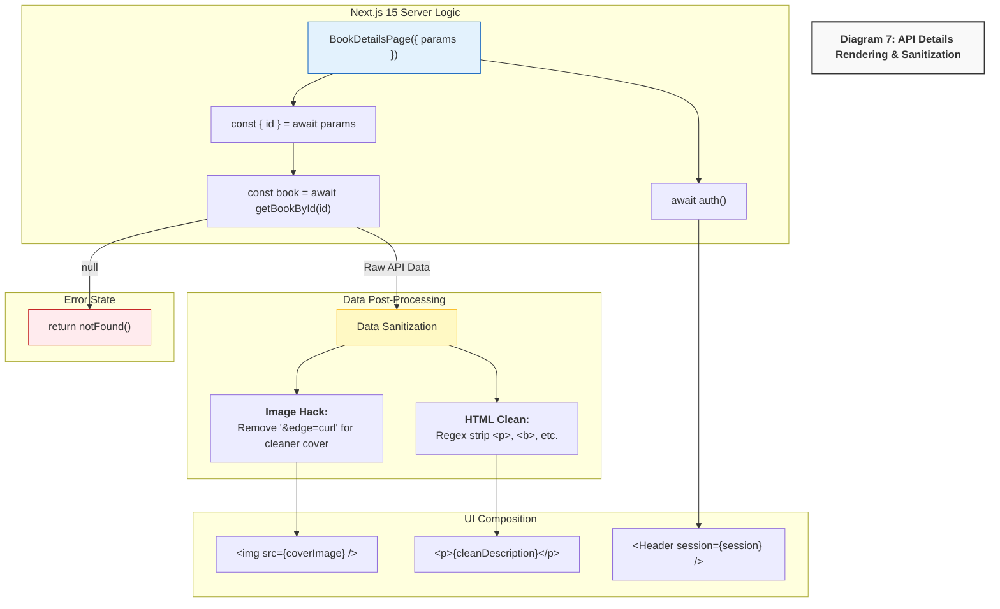
```mermaid
graph TD
    %% Diagram Title
    Title_D7["<b>Diagram 7: API Details Rendering & Sanitization</b>"]
    style Title_D7 fill:#f9f9f9,stroke:#333,stroke-width:2px,font-size:16px

    subgraph "Next.js 15 Server Logic"
        START["BookDetailsPage({ params })"]
        WAIT["const { id } = await params"]
        AUTH["await auth()"]
        CALL["const book = await getBookById(id)"]

        START --> WAIT
        START --> AUTH
        WAIT --> CALL
    end

    subgraph "Data Post-Processing"
        CALL -- "Raw API Data" --> PROCESS["Data Sanitization"]

        IMG["<b>Image Hack:</b><br/>Remove '&edge=curl' for cleaner cover"]
        DESC["<b>HTML Clean:</b><br/>Regex strip &lt;p&gt;, &lt;b&gt;, etc."]

        PROCESS --> IMG
        PROCESS --> DESC
    end

    subgraph "UI Composition"
        IMG --> COVER["&lt;img src={coverImage} /&gt;"]
        DESC --> TEXT["&lt;p&gt;{cleanDescription}&lt;/p&gt;"]
        AUTH --> HEADER["&lt;Header session={session} /&gt;"]
    end

    subgraph "Error State"
        CALL -- "null" --> 404["return notFound()"]
    end

    style PROCESS fill:#fff9c4,stroke:#fbc02d
    style START fill:#e3f2fd,stroke:#1565c0
    style 404 fill:#ffebee,stroke:#c62828
```

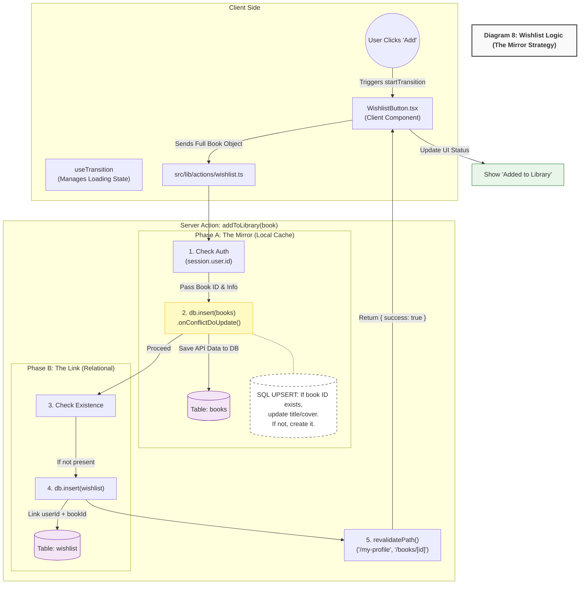
```mermaid
graph TD
    %% Diagram Title
    Title_D8["<b>Diagram 8: Wishlist Logic (The Mirror Strategy)</b>"]
    style Title_D8 fill:#f9f9f9,stroke:#333,stroke-width:2px,font-size:16px

    subgraph "Client Side"
        BTN["WishlistButton.tsx<br/>(Client Component)"]
        TRANSITION["useTransition<br/>(Manages Loading State)"]

        USER(("User Clicks 'Add'")) -- "Triggers startTransition" --> BTN
        BTN -- "Sends Full Book Object" --> ACTION
    end

    subgraph "Server Action: addToLibrary(book)"
        ACTION["src/lib/actions/wishlist.ts"]
        AUTH["1. Check Auth<br/>(session.user.id)"]

        ACTION --> AUTH

        subgraph "Phase A: The Mirror (Local Cache)"
            DB_BOOKS[("Table: books")]
            UPSERT["2. db.insert(books)<br/>.onConflictDoUpdate()"]

            AUTH -- "Pass Book ID & Info" --> UPSERT
            UPSERT -- "Save API Data to DB" --> DB_BOOKS

            note1[("SQL UPSERT: If book ID exists,<br/>update title/cover.<br/>If not, create it.")]
            style note1 fill:#fff,stroke:#333,stroke-dasharray: 5 5
            UPSERT -.- note1
        end

        subgraph "Phase B: The Link (Relational)"
            DB_WISH[("Table: wishlist")]
            CHECK["3. Check Existence"]
            INSERT_WISH["4. db.insert(wishlist)"]

            UPSERT -- "Proceed" --> CHECK
            CHECK -- "If not present" --> INSERT_WISH
            INSERT_WISH -- "Link userId + bookId" --> DB_WISH
        end

        REVAL["5. revalidatePath()<br/>('/my-profile', '/books/[id]')"]
        INSERT_WISH --> REVAL
        REVAL -- "Return { success: true }" --> BTN
    end

    %% Visual feedback loop
    BTN -- "Update UI Status" --> SUCCESS["Show 'Added to Library'"]

    style DB_BOOKS fill:#f3e5f5,stroke:#7b1fa2
    style DB_WISH fill:#f3e5f5,stroke:#7b1fa2
    style UPSERT fill:#fff9c4,stroke:#fbc02d
    style SUCCESS fill:#e8f5e9,stroke:#2e7d32
```

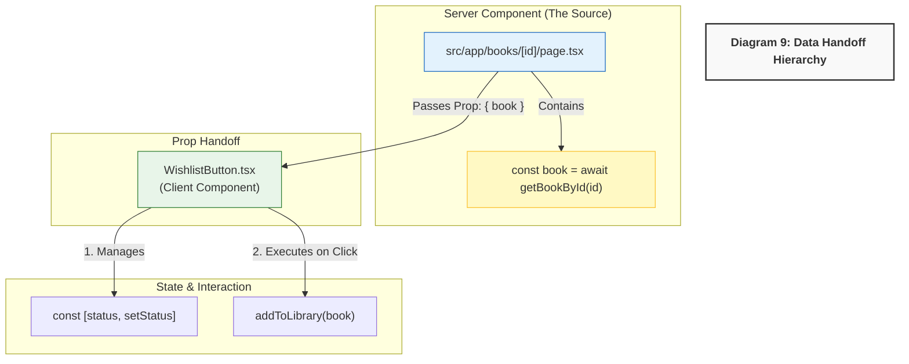
```mermaid
graph TD
    %% Diagram Title
    Title_D9["<b>Diagram 9: Data Handoff Hierarchy</b>"]
    style Title_D9 fill:#f9f9f9,stroke:#333,stroke-width:2px,font-size:16px

    subgraph "Server Component (The Source)"
        PAGE["src/app/books/[id]/page.tsx"]
        API_DATA["const book = await getBookById(id)"]

        PAGE -- "Contains" --> API_DATA
    end

    subgraph "Prop Handoff"
        BTN["WishlistButton.tsx<br/>(Client Component)"]

        PAGE -- "Passes Prop: { book }" --> BTN
    end

    subgraph "State & Interaction"
        STATE["const [status, setStatus]"]
        ACTION_CALL["addToLibrary(book)"]

        BTN -- "1. Manages" --> STATE
        BTN -- "2. Executes on Click" --> ACTION_CALL
    end

    style PAGE fill:#e3f2fd,stroke:#1565c0
    style BTN fill:#e8f5e9,stroke:#2e7d32
    style API_DATA fill:#fff9c4,stroke:#fbc02d
```

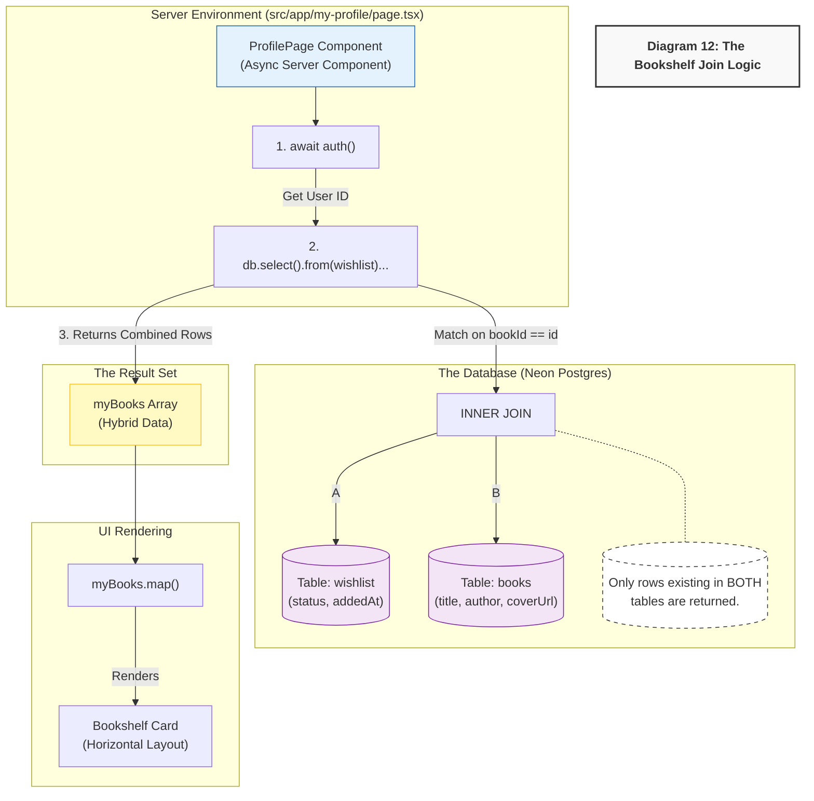
```mermaid
graph TD
    %% Diagram Title
    Title_D12["<b>Diagram 12: The Bookshelf Join Logic</b>"]
    style Title_D12 fill:#f9f9f9,stroke:#333,stroke-width:2px,font-size:16px

    subgraph "Server Environment (src/app/my-profile/page.tsx)"
        PAGE["ProfilePage Component<br/>(Async Server Component)"]
        AUTH["1. await auth()"]
        QUERY["2. db.select().from(wishlist)..."]

        PAGE --> AUTH
        AUTH -- "Get User ID" --> QUERY
    end

    subgraph "The Database (Neon Postgres)"
        T_WISH[("Table: wishlist<br/>(status, addedAt)")]
        T_BOOKS[("Table: books<br/>(title, author, coverUrl)")]

        QUERY -- "Match on bookId == id" --> JOIN["INNER JOIN"]

        JOIN -- "A" --> T_WISH
        JOIN -- "B" --> T_BOOKS

        note1[("Only rows existing in BOTH<br/>tables are returned.")]
        style note1 fill:#fff,stroke:#333,stroke-dasharray: 5 5
        JOIN -.- note1
    end

    subgraph "The Result Set"
        COLLECTION["myBooks Array<br/>(Hybrid Data)"]
        QUERY -- "3. Returns Combined Rows" --> COLLECTION
    end

    subgraph "UI Rendering"
        MAP["myBooks.map()"]
        CARD["Bookshelf Card<br/>(Horizontal Layout)"]

        COLLECTION --> MAP
        MAP -- "Renders" --> CARD
    end

    style T_WISH fill:#f3e5f5,stroke:#7b1fa2
    style T_BOOKS fill:#f3e5f5,stroke:#7b1fa2
    style PAGE fill:#e3f2fd,stroke:#1565c0
    style COLLECTION fill:#fff9c4,stroke:#fbc02d
```

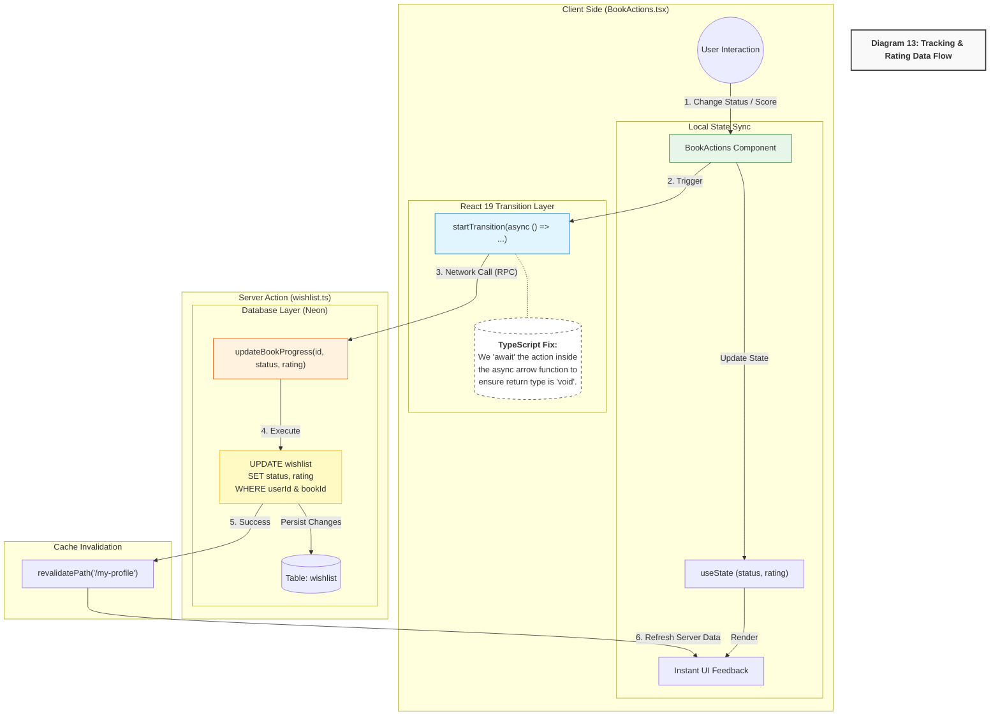
```mermaid
graph TD
    %% Diagram Title
    Title_D13["<b>Diagram 13: Tracking & Rating Data Flow</b>"]
    style Title_D13 fill:#f9f9f9,stroke:#333,stroke-width:2px,font-size:16px

    subgraph "Client Side (BookActions.tsx)"
        USER(("User Interaction")) -- "1. Change Status / Score" --> COMP["BookActions Component"]

        subgraph "Local State Sync"
            STATE["useState (status, rating)"]
            UI["Instant UI Feedback"]
            COMP -- "Update State" --> STATE
            STATE -- "Render" --> UI
        end

        subgraph "React 19 Transition Layer"
            TRANS["startTransition(async () => ...)"]
            COMP -- "2. Trigger" --> TRANS

            note_ts[("<b>TypeScript Fix:</b><br/>We 'await' the action inside<br/>the async arrow function to<br/>ensure return type is 'void'.")]
            style note_ts fill:#fff,stroke:#333,stroke-dasharray: 5 5
            TRANS -.- note_ts
        end
    end

    subgraph "Server Action (wishlist.ts)"
        ACTION["updateBookProgress(id, status, rating)"]
        TRANS -- "3. Network Call (RPC)" --> ACTION

        subgraph "Database Layer (Neon)"
            DB_WISH[("Table: wishlist")]
            SQL_UPDATE["UPDATE wishlist<br/>SET status, rating<br/>WHERE userId & bookId"]

            ACTION -- "4. Execute" --> SQL_UPDATE
            SQL_UPDATE -- "Persist Changes" --> DB_WISH
        end
    end

    subgraph "Cache Invalidation"
        REVAL["revalidatePath('/my-profile')"]
        SQL_UPDATE -- "5. Success" --> REVAL
        REVAL -- "6. Refresh Server Data" --> UI
    end

    %% Styling
    style COMP fill:#e8f5e9,stroke:#2e7d32
    style TRANS fill:#e1f5fe,stroke:#0277bd
    style ACTION fill:#fff3e0,stroke:#e65100
    style SQL_UPDATE fill:#fff9c4,stroke:#fbc02d
```

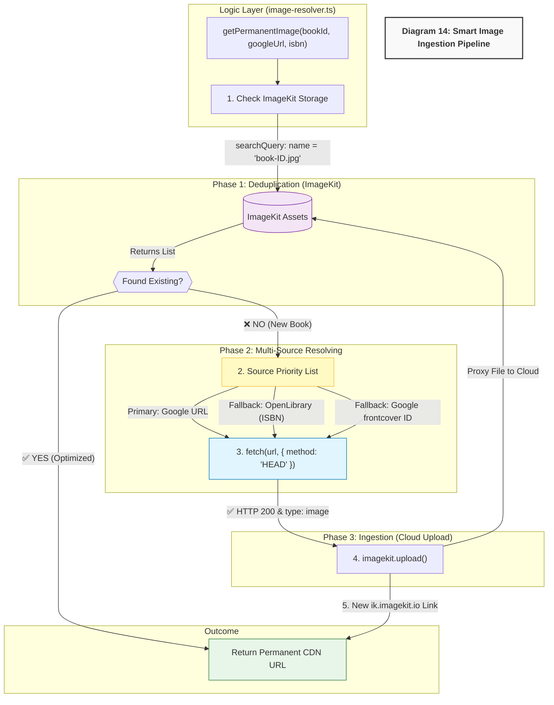
```mermaid
graph TD
    %% Diagram Title
    Title_D14["<b>Diagram 14: Smart Image Ingestion Pipeline</b>"]
    style Title_D14 fill:#f9f9f9,stroke:#333,stroke-width:2px,font-size:16px

    subgraph "Logic Layer (image-resolver.ts)"
        START["getPermanentImage(bookId, googleUrl, isbn)"]
        CHECK_IK["1. Check ImageKit Storage"]

        START --> CHECK_IK
    end

    subgraph "Phase 1: Deduplication (ImageKit)"
        IK_DB[("ImageKit Assets")]
        FOUND{{"Found Existing?"}}

        CHECK_IK -- "searchQuery: name = 'book-ID.jpg'" --> IK_DB
        IK_DB -- "Returns List" --> FOUND
    end

    subgraph "Phase 2: Multi-Source Resolving"
        SOURCE_LIST["2. Source Priority List"]
        TEST_URL["3. fetch(url, { method: 'HEAD' })"]

        FOUND -- "❌ NO (New Book)" --> SOURCE_LIST
        SOURCE_LIST -- "Primary: Google URL" --> TEST_URL
        SOURCE_LIST -- "Fallback: OpenLibrary (ISBN)" --> TEST_URL
        SOURCE_LIST -- "Fallback: Google frontcover ID" --> TEST_URL
    end

    subgraph "Phase 3: Ingestion (Cloud Upload)"
        UPLOAD["4. imagekit.upload()"]

        TEST_URL -- "✅ HTTP 200 & type: image" --> UPLOAD
        UPLOAD -- "Proxy File to Cloud" --> IK_DB
    end

    subgraph "Outcome"
        RETURN["Return Permanent CDN URL"]

        FOUND -- "✅ YES (Optimized)" --> RETURN
        UPLOAD -- "5. New ik.imagekit.io Link" --> RETURN
    end

    %% Styling
    style IK_DB fill:#f3e5f5,stroke:#7b1fa2
    style SOURCE_LIST fill:#fff9c4,stroke:#fbc02d
    style TEST_URL fill:#e1f5fe,stroke:#0277bd
    style RETURN fill:#e8f5e9,stroke:#2e7d32
```

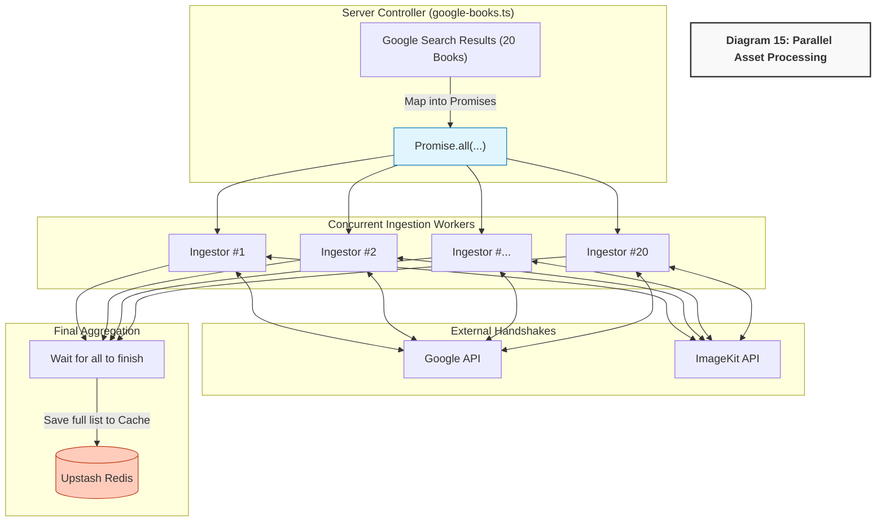
```mermaid
graph TD
    %% Diagram Title
    Title_D15["<b>Diagram 15: Parallel Asset Processing</b>"]
    style Title_D15 fill:#f9f9f9,stroke:#333,stroke-width:2px,font-size:16px

    subgraph "Server Controller (google-books.ts)"
        DATA["Google Search Results (20 Books)"]
        PROMISE_ALL["Promise.all(...)"]

        DATA -- "Map into Promises" --> PROMISE_ALL
    end

    subgraph "Concurrent Ingestion Workers"
        direction LR
        W1["Ingestor #1"]
        W2["Ingestor #2"]
        W3["Ingestor #..."]
        W20["Ingestor #20"]
    end

    PROMISE_ALL --> W1 & W2 & W3 & W20

    subgraph "External Handshakes"
        W1 & W2 & W3 & W20 <--> GOOGLE["Google API"]
        W1 & W2 & W3 & W20 <--> IK["ImageKit API"]
    end

    subgraph "Final Aggregation"
        RESOLVE["Wait for all to finish"]
        W1 & W2 & W3 & W20 --> RESOLVE
        RESOLVE -- "Save full list to Cache" --> REDIS[("Upstash Redis")]
    end

    style PROMISE_ALL fill:#e1f5fe,stroke:#0277bd
    style REDIS fill:#ffccbc,stroke:#bf360c
```
